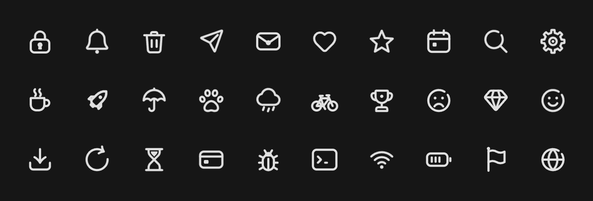

# Charade



Line icons that act out what they mean. At rest each one is the ordinary symbol: a lock looks
like a lock. When the button or link holding it is hovered or focused, the icon plays a short
animation of its own verb, once. The lock unlocks, the bell swings, the trash eats a crumb.
Then it settles back where it started.

Every icon is drawn on a 24 grid in one stroke, animated with plain CSS, and has no
dependencies. MIT licensed.

To see them all, open the gallery: serve this folder (`npx serve` or
`python3 -m http.server`) and open `index.html`. Hover an icon to play it, and click it for sizes,
stroke weights, and the code to copy.

## Use

### From a CDN

```html
<link rel="stylesheet" href="https://cdn.jsdelivr.net/gh/goodnight000/cstack@main/icons/icons.css" />
<script type="module">
  import { icon, hydrate } from "https://cdn.jsdelivr.net/gh/goodnight000/cstack@main/icons/icons.js";

  document.querySelector("#save").innerHTML = icon("download") + "Save";
  hydrate(); // or fill placeholders: <i data-icon="bell"></i>
</script>
```

### In a project

Copy this `icons/` folder into your project (or add the repository as a git submodule), then:

```js
import { icon } from "./icons/icons.js";
import "./icons/icons.css"; // or <link rel="stylesheet">
```

`icons.js` is a plain ES module and runs in browsers, bundlers, and Node (for server rendering).
`icons.css` imports the motion for each set, and bundlers inline it.

### API

```js
icon("lock"); // decorative: aria-hidden
icon("lock", { label: "Locked" }); // an image with an accessible name
icon("lock", { size: 20, class: "muted" }); // width/height and extra classes

hydrate(root); // replaces every [data-icon] element under root (default: document)

icons; // { name: inner SVG markup }
motion; // { name: one sentence on what the icon does when it plays }
sets; // [{ title, names }] in display order
```

Unknown names throw, so a typo fails where it is written.

### React and other frameworks

The icons are strings of SVG, so any framework can render them:

```jsx
import { icon } from "./icons/icons.js";

const Icon = ({ name, label, size }) => (
  <span style={{ display: "contents" }} dangerouslySetInnerHTML={{ __html: icon(name, { label, size }) }} />
);
```

### Plain SVG files

`svg/<name>.svg` has each icon at rest, for design tools, ``, or anywhere you need a still
icon. These files do not animate.

## When icons play

An icon plays when the nearest `a`, `button`, `label`, `summary`, or `[role="button"]` around it
is hovered or receives keyboard focus. So a row with several icons does not set them all off at
once.

- Add `class="ic-host"` to any other element (a card or a list row) to make it a trigger.
- Add `class="ic-play"` to an element to play every icon inside it right away. Remove and re-add
  the class to replay.
- With `prefers-reduced-motion: reduce`, nothing moves.

## Styling

Icons use `currentColor`, so they take the text color. Size them with `width` and `height`
(the default is 24) and set the weight with `stroke-width` (the default is 1.75; 1.5 to 2 keeps
the character):

```css
.toolbar .ic {
  width: 20px;
  height: 20px;
  stroke-width: 1.5;
}
```

## What makes them ours

- **The open ring.** Every circular outline, such as a clock face, a lens, or an info circle,
  stops short of closing and leaves a small gap at the upper right, like a stroke that runs into
  a loop and never quite closes.
- **One solid heart.** Most icons carry exactly one small filled part at their focal point: the
  keyhole, the clock's hub, the bell's clapper, the eye's pupil.
- **Soft, sturdy geometry.** The icons use generous corner radii and soft tips, with no sharp
  points. Circles use r 8.5 and containers are 15 to 17 units wide, so every icon sits at the
  same visual size.
- **Motion with a story.** Each animation acts out what the icon means, with a wind-up, the
  action, and a settle. Parts move against the rest of the icon, and no two icons share the same
  beat. Animations run 0.5 to 1 second, use only `transform`, `opacity`, and
  `stroke-dashoffset`, and end exactly at the rest pose.

## Icons

Generated by `npm run build` from each icon's motion note.

<!-- catalog -->

### Core

| Icon | When it plays |
| --- | --- |
| [`book`](svg/book.svg) | Two pages riffle over from right to left, and the ribbon bookmark flutters in their wake before it settles. |
| [`link`](svg/link.svg) | The right link tilts and pulls off the bar, then swings back and clicks in; the left link recoils and a spark flashes at the joint. |
| [`lock`](svg/lock.svg) | The keyhole turns, the shackle pops up and swings open, then drops back and the body clicks shut. |
| [`sliders`](svg/sliders.svg) | Each knob is flicked along its track in turn, squashing as it travels, then springs back to its setting. |
| [`log-out`](svg/log-out.svg) | The arrow draws back and shoots out through the doorway, the door frame jolts, and the arrow slides back in from inside. |
| [`send`](svg/send.svg) | The paper plane tilts back, darts off to the upper right leaving a curling dashed trail, and glides back in from the lower left to settle. |
| [`plus`](svg/plus.svg) | The upright bar lifts and drops onto the crossbar, which dips under it and springs back. |
| [`x`](svg/x.svg) | The two strokes open a little wider, snap shut like scissor blades, and spring back apart. |
| [`check`](svg/check.svg) | The tick is erased along its stroke, redrawn with a quick flick, and pressed down like a stamp. |
| [`copy`](svg/copy.svg) | The front sheet is pressed, the old copy clears, and a tinted duplicate slides up behind it to become the back sheet. |
| [`chevron`](svg/chevron.svg) | The chevron leans back, pushes forward with its point narrowing, and a faint echo carries on ahead as it snaps back. |
| [`pencil`](svg/pencil.svg) | The pencil sets down, writes a wavy line, and lifts off as the line fades. |
| [`trash`](svg/trash.svg) | The lid tips open, a crumb drops in, the lid slams and the can gulps. |
| [`search`](svg/search.svg) | The lens sweeps across in a short arc, stops, swells to magnify, and a glint crosses the glass. |
| [`card`](svg/card.svg) | The card leans back and taps forward; its chip flashes and contactless waves ripple out from it. |
| [`key`](svg/key.svg) | The key slides into the lock, turns a quarter so it goes edge-on, turns back, and draws out. |
| [`pin`](svg/pin.svg) | The pin crouches, hops up while its shadow shrinks, and plants back into the ground with a squash. |
| [`phone`](svg/phone.svg) | The handset rattles through two rings, lifting off each time, with sound waves on every ring. |
| [`tag`](svg/tag.svg) | A string appears through the hole and the tag swings on it like a pendulum until it hangs still. |
| [`shield`](svg/shield.svg) | A dart strikes the shield's side and glances off; the shield braces and the tick swells. |
| [`eye`](svg/eye.svg) | The eye glances to the side, looks back at you, blinks, and the pupil widens. |
| [`hand`](svg/hand.svg) | The hand waves hello while its fingers ripple one after another. |
| [`mobile`](svg/mobile.svg) | The island swells into a notification, the phone buzzes, and the island shrinks back. |
| [`fingerprint`](svg/fingerprint.svg) | The print dims and a scan line passes down it, lighting each ridge as it is read. |
| [`chat`](svg/chat.svg) | The bubble squeezes and puffs up from its tail, and three typing dots bounce twice in a wave. |
| [`mic`](svg/mic.svg) | Level bars rise and fall inside the capsule as it sways, and sound ripples out on both sides. |
| [`people`](svg/people.svg) | The friend behind leans out to say hello and the one in front turns toward them. |
| [`clock`](svg/clock.svg) | The minute hand winds back, sweeps a full hour and nudges the hour hand as it passes, then settles with a small overshoot. |
| [`moon`](svg/moon.svg) | The crescent rocks like a cradle while its star twinkles and turns, and a small spark winks nearby. |
| [`globe`](svg/globe.svg) | The globe spins: the meridian rolls off to the right and a new one rolls in from the left. |
| [`mail`](svg/mail.svg) | The seal pops, the flap swings open and closes again, and the seal presses back down. |
| [`calendar`](svg/calendar.svg) | The day's page tears off and falls away as the rings jolt, and the next day pops into place. |

### Navigation

| Icon | When it plays |
| --- | --- |
| [`home`](svg/home.svg) | The door lights up and two puffs of smoke rise from the chimney as the house settles. |
| [`inbox`](svg/inbox.svg) | A letter drops into the tray, which dips to catch it. |
| [`bell`](svg/bell.svg) | The bell swings on its knob, the clapper lags behind and strikes each side, and a ring sounds. |
| [`gear`](svg/gear.svg) | The cog ratchets forward two teeth while the hub tightens on each click. |
| [`grid`](svg/grid.svg) | The four tiles shuffle one place clockwise, ducking as they pass each other. |
| [`menu`](svg/menu.svg) | The bars fold up into the top one and drop back down like a list unrolling. |
| [`more`](svg/more.svg) | The first dot leapfrogs over the other two to the end of the row. |
| [`filter`](svg/filter.svg) | Three grains fall in, the funnel shakes, and only the middle one drips out the spout. |
| [`sort`](svg/sort.svg) | The arrows run like a conveyor: each leaves in its direction and comes back round from the other end. |
| [`bookmark`](svg/bookmark.svg) | The ribbon lifts and drops into place, stretching and filling as it lands. |
| [`star`](svg/star.svg) | The star crouches, jumps and spins one point around, lights up as it lands, and twinkles. |
| [`heart`](svg/heart.svg) | The heart beats lub-dub and each beat sends out an echo. |

### Arrows and actions

| Icon | When it plays |
| --- | --- |
| [`arrow-left`](svg/arrow-left.svg) | The head darts left, the shaft stretches after it like elastic and pulls it back, and a whoosh trails off the tail. |
| [`arrow-right`](svg/arrow-right.svg) | The head darts right, the shaft stretches after it like elastic and pulls it back, and a whoosh trails off the tail. |
| [`arrow-down`](svg/arrow-down.svg) | It hops up, drops, lands tip first so the shaft squashes and the head spreads, kicks up two bits of dust, and bounces once. |
| [`arrow-up`](svg/arrow-up.svg) | It crouches, launches up with a puff under its tail, and floats back down to land. |
| [`refresh`](svg/refresh.svg) | It winds back, then the head races a full turn around, reeling its tail in at speed and letting it out again as it slows. |
| [`undo`](svg/undo.svg) | The line reels back into the arrowhead like a tape measure, the head nods back, and the line unspools again. |
| [`redo`](svg/redo.svg) | The line reels forward into the arrowhead like a tape measure, the head nods on, and the line unspools again. |
| [`download`](svg/download.svg) | The arrow drops into the tray, which dips under the weight and fills for a moment, and the next arrow falls in from above. |
| [`upload`](svg/upload.svg) | The tray crouches and flings the arrow up and away, emptying as it goes, and a fresh arrow rises out of it. |
| [`share`](svg/share.svg) | The hub gathers itself and sends a copy of itself down each branch, and each node pops as its copy arrives. |
| [`external`](svg/external.svg) | The arrow fires out through the open corner and the box kicks back the other way like a recoiling cannon. |
| [`minus`](svg/minus.svg) | A piece snaps off the end of the bar and falls away, and the bar grows back. |
| [`log-in`](svg/log-in.svg) | The arrow knocks twice on the door, the door swings open, and it steps inside as the door closes after it. |

### States and tools

| Icon | When it plays |
| --- | --- |
| [`unlock`](svg/unlock.svg) | The keyhole turns, the shackle springs up and swings open on its hinge, then swings back to rest. |
| [`eye-off`](svg/eye-off.svg) | The upper lid drops shut onto the lower one, the slash wipes away and draws back across the closed eye, and the lid lifts open again. |
| [`bell-off`](svg/bell-off.svg) | The bell starts to swing but the slash stifles it to a shiver, and a small z drifts up. |
| [`check-circle`](svg/check-circle.svg) | The tick writes itself again, its last stroke flicks out through the gap in the ring, and the ring gives a small stamp. |
| [`x-circle`](svg/x-circle.svg) | The ring shakes its head no, and the x inside lags a beat behind like something loose. |
| [`ban`](svg/ban.svg) | The bar lifts like a barrier arm, slams back down across the ring, and the ring jolts from the impact. |
| [`history`](svg/history.svg) | The hands sweep a full turn backward, the ring winds back with them, and the minute hand ticks forward into place. |
| [`printer`](svg/printer.svg) | The printer hums, feeds the sheet out one line at a time as each line prints, and the light blinks. |
| [`qr-code`](svg/qr-code.svg) | A scan line sweeps down the code, and each corner square locks on as it passes. |
| [`wand`](svg/wand.svg) | The wand winds back and flicks, the star at its tip spins, and sparks fly off as the glints twinkle. |
| [`cursor`](svg/cursor.svg) | The pointer lifts, clicks down, and a small burst of rays marks the click at its tip. |

### Talk and time

| Icon | When it plays |
| --- | --- |
| [`reply`](svg/reply.svg) | The arrowhead winds up, snaps back along the line as the tail stretches after it, and a faint echo of the head keeps going. |
| [`at`](svg/at.svg) | The tail unwinds into the a, which dips, then writes itself back round the ring. |
| [`video`](svg/video.svg) | The record light blinks twice while the lens pushes out to zoom and draws back. |
| [`megaphone`](svg/megaphone.svg) | The horn tips back, kicks up with a shout, and short bursts of sound fly out of the mouth. |
| [`alarm`](svg/alarm.svg) | A hammer swings between the bells, the bells jump in turn, and the clock shivers on its legs. |
| [`hourglass`](svg/hourglass.svg) | The sand runs through in a stream of grains, then the glass tips back and turns over. |
| [`timer`](svg/timer.svg) | The crown clicks in, the hand sweeps a lap leaving a shaded wedge of elapsed time, and it clicks to a stop. |
| [`repeat`](svg/repeat.svg) | A break runs round each track into its arrowhead, and each head nudges forward as it arrives. |
| [`sun`](svg/sun.svg) | The sun squints, then its rays flick outward one by one around the dial. |
| [`cloud`](svg/cloud.svg) | The cloud billows up and settles, shedding a small wisp that drifts away. |
| [`bolt`](svg/bolt.svg) | The bolt draws up, strikes down with a flash, and sparks jump from its tip. |
| [`sparkles`](svg/sparkles.svg) | The big star glints tall then wide, the small ones twinkle after it, and a new spark winks on and out. |

### People and feelings

| Icon | When it plays |
| --- | --- |
| [`user`](svg/user.svg) | The head gives a small nod while the shoulders dip with it. |
| [`user-plus`](svg/user-plus.svg) | The plus ducks out and springs back in with a twist while the person leans aside to make room. |
| [`user-check`](svg/user-check.svg) | The check mark rubs out and redraws, and the person straightens up proudly. |
| [`contact`](svg/contact.svg) | A scan line sweeps down the card and the details write themselves back in behind it. |
| [`smile`](svg/smile.svg) | The face tilts, winks its right eye, and widens its grin. |
| [`frown`](svg/frown.svg) | The eyes droop, the mouth wobbles, and a tear rolls down the cheek. |
| [`thumbs-up`](svg/thumbs-up.svg) | The hand dips, then pumps up with the thumb flexed and a little burst beside it. |
| [`thumbs-down`](svg/thumbs-down.svg) | The hand lifts, then pumps down with the thumb flexed and a little burst beside it. |
| [`award`](svg/award.svg) | The ribbon tails flutter, the center pops, and a sparkle flies out of the gap in the medal. |
| [`trophy`](svg/trophy.svg) | The trophy is hoisted with a little tilt, and confetti pops out of the cup and flutters down. |
| [`crown`](svg/crown.svg) | The crown hops off its band, tips, and drops back on with a bounce while the jewel glints. |
| [`gem`](svg/gem.svg) | The facets turn as if the stone rotates, and a flash bursts from its corner. |

### Media and sound

| Icon | When it plays |
| --- | --- |
| [`play`](svg/play.svg) | The triangle pulls back, springs forward, and a faint copy of it carries on ahead. |
| [`pause`](svg/pause.svg) | The two bars press down in turn like held keys and come back up. |
| [`stop`](svg/stop.svg) | The square skids to a halt, leaning into the stop with skid marks behind it, and snaps upright. |
| [`skip-forward`](svg/skip-forward.svg) | The triangle darts into the bar and knocks it on a notch, then both spring back. |
| [`skip-back`](svg/skip-back.svg) | The triangle darts into the bar and knocks it back a notch, then both spring back. |
| [`shuffle`](svg/shuffle.svg) | The strands pinch together and fan back out in turn like a riffled deck, the crossing sliding along as they go. |
| [`volume`](svg/volume.svg) | The cone thumps and the sound waves swell outward in turn, with a third wave briefly joining them. |
| [`mute`](svg/mute.svg) | A sound wave peeks out and the cross snaps shut on it. |
| [`music`](svg/music.svg) | The two notes bob on alternate beats, see-sawing the beam, and a little note floats off. |
| [`film`](svg/film.svg) | The strip advances one frame on its sprocket holes and the picture flickers. |
| [`radio`](svg/radio.svg) | The antenna sways and catches a signal while the tuning knob turns. |

### Files and data

| Icon | When it plays |
| --- | --- |
| [`file`](svg/file.svg) | The folded corner flicks up and back like a thumbed page, and two lines of text show through for a moment. |
| [`folder`](svg/folder.svg) | The front flap swings open, a sheet rises to peek out, and it drops back in as the flap shuts. |
| [`image`](svg/image.svg) | The sun sets behind the hills, a star blinks in the dark, and the sun rises back into place. |
| [`paperclip`](svg/paperclip.svg) | The clip slides onto a page: its free leg springs open, snaps shut, and the clip recoils. |
| [`archive`](svg/archive.svg) | The lid swings up on its back hinge, a page drops into the box, and the lid shuts with a bump. |
| [`note`](svg/note.svg) | A gust blows past, the bottom of the note lifts and flutters, and it settles flat again. |
| [`list`](svg/list.svg) | Each bullet hops in turn down the list, and its line stretches a little as it lands. |
| [`checklist`](svg/checklist.svg) | Each tick is checked off in turn with a flick, and its line slides aside. |
| [`quote`](svg/quote.svg) | The two marks crook twice like fingers making air quotes. |
| [`chart`](svg/chart.svg) | The bars jump to new values like live data, the last one overtaking, then settle back. |
| [`newspaper`](svg/newspaper.svg) | The paper is snapped straight with a flick, and the printed columns catch up a beat later. |
| [`database`](svg/database.svg) | A record drops in through the top, and the bands dip one after another as it sinks to the bottom. |

### Editing and layout

| Icon | When it plays |
| --- | --- |
| [`zoom-in`](svg/zoom-in.svg) | The plus shrinks back, then swells big as the lens leans closer, and settles. |
| [`zoom-out`](svg/zoom-out.svg) | The minus stretches, then shrinks as the lens pulls back, and settles. |
| [`maximize`](svg/maximize.svg) | The corners wind in, then fling out to the edges as a window grows to fill the frame. |
| [`minimize`](svg/minimize.svg) | The corners wind out, then pinch in toward the middle as the window shrinks away. |
| [`sidebar`](svg/sidebar.svg) | The sidebar tucks into the edge and slides back out to its width. |
| [`columns`](svg/columns.svg) | Each column fills with content in turn, left to right, then clears. |
| [`table`](svg/table.svg) | A selected cell hops across the grid like arrow keys, then clears. |
| [`layers`](svg/layers.svg) | The top sheet lifts off and the stack fans apart, then the layers settle back in order. |
| [`crop`](svg/crop.svg) | The two crop handles close in to frame a smaller area, then ease back out. |
| [`scissors`](svg/scissors.svg) | The blades snip twice around the pivot, and a trimmed bit drops away. |
| [`type`](svg/type.svg) | The crossbar hops up and lands back on the stem, its arms dipping on impact. |
| [`bold`](svg/bold.svg) | The B puffs out its bowls one after the other, as if flexing. |
| [`italic`](svg/italic.svg) | The letter stands up straight, then leans hard into its slant and springs back. |
| [`underline`](svg/underline.svg) | The underline is struck again from left to right, and the U dips as the pen passes under it. |
| [`align-left`](svg/align-left.svg) | The lines drift out to the right by different amounts, then snap flush against the left edge. |
| [`list-ordered`](svg/list-ordered.svg) | Each number flips over in turn like a counter card, 1 then 2. |
| [`palette`](svg/palette.svg) | A brush dabs each paint well in turn around the palette, and the palette tips in the hand. |

### Build and system

| Icon | When it plays |
| --- | --- |
| [`code`](svg/code.svg) | The brackets spring apart, the slash spins a half turn between them, and they clamp back in. |
| [`terminal`](svg/terminal.svg) | The cursor blinks, a command types out behind it, the prompt nudges forward to run it, and the line clears. |
| [`git-branch`](svg/git-branch.svg) | The branch pulls back into the trunk, grows out again, and its tip commit pops into place. |
| [`bug`](svg/bug.svg) | The bug scurries forward on alternating legs with its feelers twitching, then backs into place. |
| [`cpu`](svg/cpu.svg) | A pulse runs clockwise round the pins, and the core flashes with heat when the lap closes. |
| [`server`](svg/server.svg) | The top unit slides out like a drawer while the lights blink with traffic, then slides back in with a clunk. |
| [`plug`](svg/plug.svg) | The plug dips, pushes up into the socket with a spark at the prongs, and drops back down on its cord. |
| [`power`](svg/power.svg) | The stem presses down, the ring drains to the bottom and fills back up to the top, and the stem springs back. |
| [`bluetooth`](svg/bluetooth.svg) | The rune dims while a spark runs along its single stroke, then it lights back up and pairing waves blink on both sides. |
| [`toggle`](svg/toggle.svg) | The knob stretches as it slides off, then slides back on with a squash and the track lights up. |
| [`loader`](svg/loader.svg) | A bright pulse runs once around the spokes, each one reaching out as it passes, and the lap ends on the lead spoke. |
| [`command`](svg/command.svg) | The four loops pull in toward the middle one after another like a knot tightening, then spring back out. |
| [`puzzle`](svg/puzzle.svg) | The piece lifts out of its slot and turns, then drops back in and clicks. |
| [`bot`](svg/bot.svg) | The robot blinks, its antenna boings on its spring, and it beeps. |
| [`keyboard`](svg/keyboard.svg) | Keys tap down in a quick typing run, a line of text appears above, and the space bar thumps at the end. |
| [`monitor`](svg/monitor.svg) | The screen switches on from a bright line that opens to fill it, a glint sweeps across, and it goes dark again. |

### Devices and status

| Icon | When it plays |
| --- | --- |
| [`laptop`](svg/laptop.svg) | The lid swings shut, the sleep light glows, and it springs back open as two lines of text type across the screen. |
| [`watch`](svg/watch.svg) | The minute hand winds back, sweeps a full hour, and the watch buzzes on the wrist when it reaches the top. |
| [`wifi`](svg/wifi.svg) | The dot dips and sends a ripple out through each arc in turn, and the last wave carries on past the edge. |
| [`battery`](svg/battery.svg) | The bars drain from right to left, a bolt flashes in the empty case, and the bars charge back up one by one. |
| [`headphones`](svg/headphones.svg) | The band stretches as the cups pull apart, they snap back on, and a note floats up between them to the beat. |
| [`camera`](svg/camera.svg) | The body presses down, the lens iris snaps shut and reopens, and the light flares with a flash at the corner. |
| [`bulb`](svg/bulb.svg) | The filament flickers twice, catches, and the bulb glows with rays before it dims again. |
| [`target`](svg/target.svg) | A dart flies in through the gap in the ring, thunks into the bullseye so the rings shudder, quivers, and is pulled out. |
| [`info`](svg/info.svg) | The stem crouches and throws the dot up, then catches it with a small squash as it lands. |
| [`alert`](svg/alert.svg) | The mark jolts up to attention while the dot blinks twice like a hazard light and flares flash around the sign. |
| [`help`](svg/help.svg) | The question mark cocks its head one way, then the other, like a puzzled dog, before it straightens up. |

### Money and places

| Icon | When it plays |
| --- | --- |
| [`wallet`](svg/wallet.svg) | The wallet squeezes, the card is pulled up out of it at a tilt, and it drops back in with a bulge. |
| [`receipt`](svg/receipt.svg) | A new line prints at the bottom, the rows feed up one, and the top row slides off under the edge. |
| [`cart`](svg/cart.svg) | A box drops into the basket and bounces once, and the basket dips on its wheels to catch it. |
| [`bag`](svg/bag.svg) | The handle pulls taut first, the bag rises after it and sways, then is set down with a squash. |
| [`gift`](svg/gift.svg) | The box swells, the lid pops off at a tilt with a burst of confetti, and it lands back on. |
| [`coin`](svg/coin.svg) | The coin is tossed, flips twice over its shadow, lands with a bounce, and glints at the gap. |
| [`building`](svg/building.svg) | Night falls: the windows light from the bottom floor up, then go dark, and one on top stays on late. |
| [`car`](svg/car.svg) | The engine revs twice, the body rocking back on its wheels with a puff from the exhaust each time. |
| [`plane`](svg/plane.svg) | The plane pushes forward and does a barrel roll while two contrails stream from its wingtips. |
| [`map`](svg/map.svg) | The side panels fold in one after the other, spring back open, and the you-are-here dot pops. |
| [`compass`](svg/compass.svg) | The case is turned and the needle lags, swings past north, and hunts back to where it was. |
| [`flag`](svg/flag.svg) | The flag slides down the pole, is hoisted back up in two tugs, and flutters at the top. |

### Work and commerce

| Icon | When it plays |
| --- | --- |
| [`briefcase`](svg/briefcase.svg) | The clasp drops, the lid lifts on its hinge so a sheet of paper peeks out, and it clicks shut. |
| [`box`](svg/box.svg) | The package hops, lands on one corner, tips flat, and the loose end of tape flaps and sticks back down. |
| [`truck`](svg/truck.svg) | The truck rolls forward with speed lines and brakes hard, its body pitching onto the front wheels and rocking back. |
| [`ticket`](svg/ticket.svg) | The stub is torn along the perforation and swings away, then snaps back into place. |
| [`store`](svg/store.svg) | The awning edge rolls up and drops open with a flap while the door swings open and shut. |
| [`bank`](svg/bank.svg) | The roof lifts as the columns stretch up one after another, then it drops back and they take the weight in turn. |
| [`calculator`](svg/calculator.svg) | Three keys tap and their digits shift into the display, then the equals key swaps them for a result. |
| [`percent`](svg/percent.svg) | The two circles orbit to trade places while the slash ducks to let them pass. |
| [`trending-up`](svg/trending-up.svg) | The line reels back to its start and draws up again with the arrowhead riding the tip. |
| [`trending-down`](svg/trending-down.svg) | The line reels back to its start and draws down again with the arrowhead riding the tip. |
| [`pie-chart`](svg/pie-chart.svg) | The slice sinks into the pie, pops back out tilted and drops a crumb, then settles into place. |
| [`activity`](svg/activity.svg) | A blip runs along the trace and each peak spikes as it passes, like two heartbeats. |

### Food, health and travel

| Icon | When it plays |
| --- | --- |
| [`coffee`](svg/coffee.svg) | The steam curls up and drifts off, and fresh wisps rise out of the cup. |
| [`utensils`](svg/utensils.svg) | The fork and knife lean in, clink at the tips, and spring apart. |
| [`bike`](svg/bike.svg) | The pedals turn and the bike pops a wheelie, then lands back on both wheels. |
| [`train`](svg/train.svg) | The train rocks on its wheels as the sleepers rush under it, and its lamp flashes twice. |
| [`rocket`](svg/rocket.svg) | The rocket rumbles, fires, lifts off in a puff of smoke, and eases back onto the pad. |
| [`graduation`](svg/graduation.svg) | The cap is tossed, turns in the air, and lands while the tassel swings behind it. |
| [`pill`](svg/pill.svg) | The capsule twists open, a few grains spill out, and it clicks shut. |
| [`first-aid`](svg/first-aid.svg) | The cross beats twice like a pulse and the case thumps along with it. |
| [`paw`](svg/paw.svg) | The paw presses down with its toes spread, lifts away leaving a print, and steps back in. |
| [`bed`](svg/bed.svg) | The pillow is plumped and a couple of z's drift up off it. |

### Weather and nature

| Icon | When it plays |
| --- | --- |
| [`cloud-rain`](svg/cloud-rain.svg) | The cloud wrings itself out and two waves of rain fall and splash on the ground. |
| [`snowflake`](svg/snowflake.svg) | The flake turns one sixth while a shimmer runs round the tips of its arms. |
| [`wind`](svg/wind.svg) | A break runs along each gust and out through its curl, one gust after another. |
| [`thermometer`](svg/thermometer.svg) | The bulb squeezes, the mercury shoots to the top, wavers, and cools back down. |
| [`umbrella`](svg/umbrella.svg) | A raindrop lands on the canopy and runs off, and the canopy shakes the rest away. |
| [`droplet`](svg/droplet.svg) | The drop stretches, falls and splashes, and a new one swells from the tip. |
| [`flame`](svg/flame.svg) | The flame flickers and flares, its heart leaps, and an ember floats off the tip. |
| [`leaf`](svg/leaf.svg) | The leaf lets go and drifts down side to side, and a new one unfurls from the stem. |
| [`tree`](svg/tree.svg) | The tree crouches, shoots up with its crown puffed out, and settles. |
| [`mountain`](svg/mountain.svg) | A flag is planted on the summit and flutters while the sun beams. |

<!-- /catalog -->

## Adding or changing an icon

1. Draw it in the set that fits, in `sets/<set>.js`, on the 24 grid. Give moving parts a class
   that starts with `i-` (`i-lid`, `i-needle`), so page CSS can never reach inside an icon. Mark
   parts that only appear while the icon plays with `i-fx`, and lines that draw in with `i-ink`
   (plus `pathLength="1"`).
2. Animate it in `sets/<set>.css`, inside that file's trigger block, and name its keyframes
   `ic-<icon>-<part>`.
3. Write its `motion` note: one plain sentence on what it does.
4. Run `npm run build`. It checks for duplicate names, keyframes that collide across sets,
   animations that are never defined, and icons without motion or a note. Then it regenerates
   `svg/` and the catalog above.
